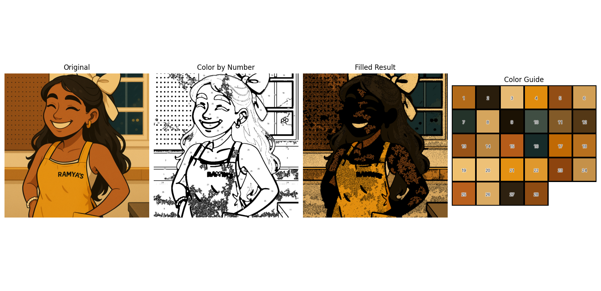

# Color by Number

_Inspired by my new found summer hobby (I just wish I was coloring with color pencils instead of an Apple Pencil)._

Below is the first iteration of my color by number

Note that there is a lot of distortion between the original image to the new image. Currently trying to fix it ✨

---

Note for future works:

- Editing image processing to avoid generating all the smaller regions and black dot distortions
- Interactive component of a real color-by-number image.

---

_created for fun with Claude <3_
