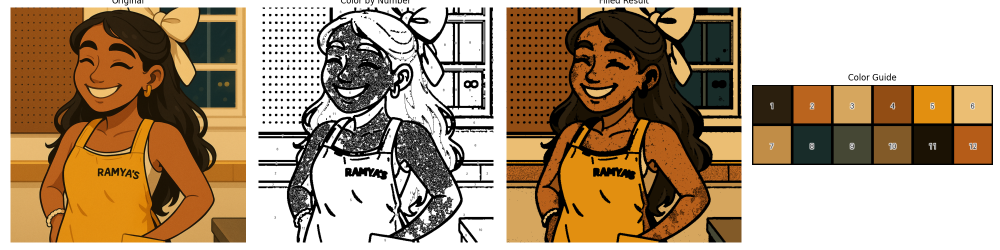
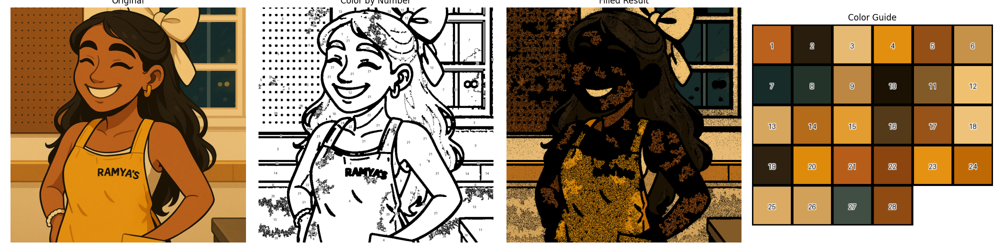
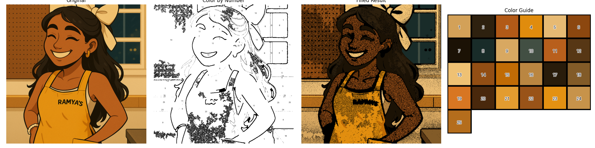

# Color by Number

_Inspired by my new found summer hobby (I just wish I was coloring with color pencils instead of an Apple Pencil)._

**[Iteration 3] Bilateral Edge Detection & Improved Color Concatenation:**

**[Iteration 2] Bilateral Edge Detection:**

**[Iteration 1] Gaussian Edge Detection:**

_Note that there is a lot of distortion between the original image to the new, color by number image. Currently trying to fix it ✨_

---

Note for future works:

- Editing image processing to avoid generating all the smaller regions and black dot distortions
- Interactive component of a real color-by-number image.

---

_created for fun with Claude <3_
